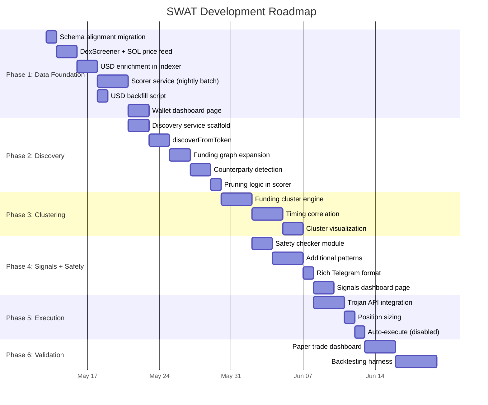

# SWAT Project Review & Next Steps
**Review Date:** 12 May 2026  
**Spec Reference:** [swat.md](file:///home/xahmie/Documents/SWAT/swat.md)  
**Project Root:** [/home/xahmie/Documents/SWAT](file:///home/xahmie/Documents/SWAT)

---

## 1. Executive Summary

The SWAT monorepo has a **solid scaffold** in place — the folder structure, turborepo tooling, shared packages, database schema, and five of the six spec-defined services exist with real code. However, the project is currently at the **very early stages of Phase 1** of the [six-phase roadmap](file:///home/xahmie/Documents/SWAT/swat.md#L1204-L1269). Most services are functional shells that demonstrate inter-service wiring (BullMQ queues, Redis pub/sub) but contain stub logic rather than production implementations.

**Bottom line:** The architecture is well-founded. The codebase needs to transition from *scaffold* to *working MVP* by filling in the critical data enrichment, scoring, and discovery systems that the entire intelligence pipeline depends on.

---

## 2. What Has Been Built ✅

### 2.1 Infrastructure & Tooling

| Component | Status | Notes |
|-----------|--------|-------|
| **Monorepo (pnpm + Turborepo)** | ✅ Complete | Scripts, workspace config, tsconfig inheritance all working |
| **Docker Compose** | ✅ Complete | PostgreSQL 16 + Redis 7, volumes mapped |
| **Environment config** | ✅ Complete | `.env.example` covers all required vars |
| **DB migration runner** | ✅ Complete | [migrate.ts](file:///home/xahmie/Documents/SWAT/packages/db/src/migrate.ts) reads and executes SQL |

### 2.2 Database Schema ([001_init.sql](file:///home/xahmie/Documents/SWAT/packages/db/sql/001_init.sql))

| Table | Status | Gap vs Spec |
|-------|--------|-------------|
| `wallets` | ✅ Created | Missing `priority` column (spec has `high/normal/low`) |
| `tokens` | ✅ Created | Missing `mint_authority_disabled`, `freeze_authority_disabled` columns |
| `transactions` | ✅ Created | Schema matches spec |
| `wallet_clusters` | ✅ Created | Missing `cluster_type` column (spec: `funding/timing/behavioral/mixed`) |
| `cluster_memberships` | ✅ Created | Matches spec |
| `wallet_relationships` | ✅ Created | Matches spec |
| `signals` | ✅ Created | Missing `safety_flags`, `safety_warnings`, `alerted_at` columns |
| `trades` | ✅ Created | Missing `execution_mode`, `executor`, `amount_sol` columns vs spec |
| `config` | ✅ Created | Seed values differ slightly from spec defaults |
| `discovery_log` | ❌ Missing | Spec requires it for tracking discovery runs |

### 2.3 Shared Packages

| Package | Status | Content |
|---------|--------|---------|
| **[@swat/shared](file:///home/xahmie/Documents/SWAT/packages/shared/src/index.ts)** | ✅ Functional | Types, Zod validation, composite scoring (`calculateCompositeScore`, `scoreToTier`), risk constants, Redis channel names |
| **[@swat/db](file:///home/xahmie/Documents/SWAT/packages/db/src/index.ts)** | ✅ Functional | PG pool, wallet CRUD, transaction insert with conflict handling, signal insert with deduplication |

### 2.4 Services

| Service | File | Lines | Maturity |
|---------|------|-------|----------|
| **API** | [index.ts](file:///home/xahmie/Documents/SWAT/apps/api/src/index.ts) | 72 | 🟡 Routes stubbed — wallets CRUD works, everything else returns empty |
| **Indexer** | [index.ts](file:///home/xahmie/Documents/SWAT/apps/indexer/src/index.ts) | 260 | 🟢 **Most mature** — real Helius RPC calls, tx parsing, backfill worker |
| **Signal Engine** | [index.ts](file:///home/xahmie/Documents/SWAT/apps/signal-engine/src/index.ts) | 81 | 🟡 Snipe pattern only, hardcoded scores, no safety checks |
| **Alert Service** | [index.ts](file:///home/xahmie/Documents/SWAT/apps/alert-service/src/index.ts) | 76 | 🟡 Telegram sending works, simplified format vs spec |
| **Trade Executor** | [index.ts](file:///home/xahmie/Documents/SWAT/apps/trade-executor/src/index.ts) | 45 | 🟠 Paper mode stub, no real execution path |
| **Web Dashboard** | [page.tsx](file:///home/xahmie/Documents/SWAT/apps/web/app/page.tsx) | 29 | 🔴 Placeholder — just shows API health status |

### 2.5 What's Working End-to-End


> [!TIP]
> The ingestion pipeline (Indexer → Helius RPC → DB) is the strongest piece. The inter-service wiring via BullMQ and Redis pub/sub is already functional. The project can build on this foundation without re-architecting.

---

## 3. Gap Analysis vs swat.md Specification

### Phase 1: Real Data Foundation (Spec §15 — Weeks 1–2)

| Requirement | Status | Detail |
|-------------|--------|--------|
| DexScreener USD enrichment on transaction insert | ❌ **Not built** | `amount_in_usd` / `amount_out_usd` are always NULL |
| SOL price feed (cached 30s) | ❌ **Not built** | No DexScreener or price API integration |
| Nightly scoring batch | ❌ **Not built** | `calculateCompositeScore` exists in shared pkg but no batch runner calls it |
| Wallet performance on frontend | ❌ **Not built** | Frontend is a placeholder |

> [!IMPORTANT]
> **USD enrichment is the #1 blocker.** Every downstream system — scoring, cluster ROI, signal quality, P&L tracking — depends on transactions having USD values. This is explicitly called out as the **first action** in the spec's conclusion (§17, line 1356).

---

### Phase 2: Autonomous Discovery (Spec §4 — Weeks 3–4)

| Requirement | Status |
|-------------|--------|
| `discoverFromToken()` | ❌ Not built |
| `expandFromFundingGraph()` | ❌ Not built |
| `discoverFromCounterparties()` | ❌ Not built |
| Nightly pruning logic | ❌ Not built |
| Discovery API endpoint | ❌ Stubbed but not wired |
| Discovery log table | ❌ Missing from schema |
| `apps/discovery/` service | ❌ **Folder doesn't exist** (spec §B shows it) |
| `apps/scorer/` service | ❌ **Folder doesn't exist** (spec §B shows it) |

---

### Phase 3: Clustering (Spec §6 — Weeks 5–6)

| Requirement | Status |
|-------------|--------|
| Funding-source clustering | ❌ Not built |
| Timing correlation clustering | ❌ Not built |
| Behavioral clustering | ❌ Not built |
| Cluster confidence scoring | ❌ Not built |
| Cluster performance tracking | ❌ Not built |
| Cluster graph visualization | ❌ Not built |

---

### Phase 4: Signals + Safety + Alerts (Spec §7–8 — Weeks 7–8)

| Requirement | Status | Detail |
|-------------|--------|--------|
| Safety checker (mint/freeze/holders/liquidity) | ❌ Not built | No safety checks run before alerts fire |
| Pattern: Snipe | 🟡 Partial | Implemented but with hardcoded confidence (87) and score (82) |
| Pattern: Accumulation | ❌ Not built | |
| Pattern: Rotation | ❌ Not built | |
| Pattern: Exit | ❌ Not built | |
| Pattern: Stealth Buy | ❌ Not built | |
| Execution-ready alert format | 🟡 Partial | Simplified vs the rich spec format (§8.1) |
| Exit signal alerts | ❌ Not built | |
| Signal deduplication | ✅ Built | `insertSignalWithDedupe` with configurable window |
| Signal 10-min expiry | ✅ Built | `expires_at` set in dedup insert |

---

### Phase 5: Execution Integration (Spec §9 — Weeks 9–10)

| Requirement | Status |
|-------------|--------|
| Trojan bot API integration | ❌ Not built |
| Position sizing logic | ❌ Not built (spec function exists, not in code) |
| Auto-execute for score ≥ 90 | ❌ Not built |
| Trade logging with full context | 🟡 Minimal |
| Circuit breaker | ✅ Built | Consecutive failure counter in trade-executor |

---

### Phase 6: Validation & Tuning (Spec §15 — Weeks 11–12)

| Requirement | Status |
|-------------|--------|
| Paper trade results dashboard | ❌ Not built |
| Signal score tuning | ❌ Not built |
| Backtesting harness | ❌ Not built |

---

### Cross-Cutting Gaps

| Area | Spec Requirement | Status |
|------|------------------|--------|
| **API Auth** | JWT on all endpoints | ❌ No auth middleware |
| **Webhook Security** | Helius webhook signature verification | ❌ No webhook endpoint exists |
| **Rate Limiting** | 100 req/min per IP | ❌ Not implemented |
| **WebSocket** | Real-time signal/trade/score push | ❌ Not implemented |
| **Helius Webhooks** | Real-time wallet monitoring (always-on) | ❌ Only backfill exists (poll-based) |
| **Frontend** | 6 pages (Dashboard, Wallets, Clusters, Signals, Discovery, Settings) | ❌ Only placeholder page |

---

## 4. Service Maturity Matrix

```mermaid
quadrantChart
    title Service Maturity vs Business Impact
    x-axis Low Maturity --> High Maturity
    y-axis Low Impact --> High Impact
    quadrant-1 Build Next
    quadrant-2 Maintain
    quadrant-3 Low Priority
    quadrant-4 Foundation Ready
    Indexer: [0.75, 0.85]
    Signal Engine: [0.35, 0.90]
    Alert Service: [0.40, 0.70]
    API Server: [0.45, 0.60]
    Trade Executor: [0.20, 0.50]
    Web Dashboard: [0.10, 0.40]
    Scorer (missing): [0.0, 0.80]
    Discovery (missing): [0.0, 0.75]
    DB Package: [0.65, 0.70]
    Shared Package: [0.70, 0.50]
```

---

## 5. Prioritised Next Steps

### 🔴 Priority 1: USD Enrichment & SOL Price Feed (Phase 1 — Critical Path)

> [!CAUTION]
> This is the **single most important** piece of work. Without USD values in transactions, scoring, cluster ROI, signal quality, and P&L are all impossible.

**Files to create/modify:**

| Action | File | Description |
|--------|------|-------------|
| **CREATE** | `packages/shared/src/prices.ts` | DexScreener price fetcher + SOL price feed with 30s Redis cache |
| **MODIFY** | [transactions.ts](file:///home/xahmie/Documents/SWAT/packages/db/src/transactions.ts) | Accept and persist `amount_in_usd` / `amount_out_usd` |
| **MODIFY** | [indexer/index.ts](file:///home/xahmie/Documents/SWAT/apps/indexer/src/index.ts) | Call price enrichment before `insertParsedTransaction` |
| **CREATE** | `packages/shared/src/dexscreener.ts` | DexScreener API client (token price, liquidity) |

**Technical approach:**
```
1. Fetch SOL/USD from DexScreener (or CoinGecko fallback), cache in Redis (key: `sol:price`, TTL: 30s)
2. For each transaction insert, resolve USD value:
   - BUY:  amount_in_usd = (amountIn / 1e9) × SOL_price
   - SELL: amount_out_usd = (amountOut / 1e9) × SOL_price
3. For token-to-token swaps, use DexScreener token price endpoint
4. Backfill script to retroactively enrich existing NULL USD rows
```

---

### 🔴 Priority 2: Scorer Service (Phase 1 — Critical Path)

**Files to create:**

| Action | File | Description |
|--------|------|-------------|
| **CREATE** | `apps/scorer/` | New service directory (package.json, tsconfig, src/index.ts) |
| **CREATE** | `apps/scorer/src/index.ts` | Nightly batch: compute metrics per wallet → write composite_score + tier |
| **CREATE** | `packages/db/src/scoring-queries.ts` | SQL queries for win rate, realized ROI (FIFO), early entry score |

**Scoring pipeline:**
```
1. For each active wallet:
   a. Calculate win_rate from closed positions (sell USD > buy cost basis)
   b. Calculate realized_roi using FIFO cost basis matching
   c. Calculate early_entry_score (% of tokens bought within 10 min of first recorded tx)
   d. Calculate consistency_score (1 - coefficient of variation of monthly ROI)
2. Run calculateCompositeScore() from @swat/shared
3. Assign tier via scoreToTier()
4. UPDATE wallets SET composite_score, tier, win_rate, realized_roi, etc.
5. Run pruning rules (score < 40 after 50+ trades → pause; inactive > 30 days → pause)
```

---

### 🟡 Priority 3: Discovery Engine (Phase 2)

**Files to create:**

| Action | File | Description |
|--------|------|-------------|
| **CREATE** | `apps/discovery/` | New service directory |
| **CREATE** | `apps/discovery/src/index.ts` | Three discovery strategies + nightly schedule |
| **ADD** | `discovery_log` table | New migration `002_discovery_log.sql` |
| **MODIFY** | [api/index.ts](file:///home/xahmie/Documents/SWAT/apps/api/src/index.ts) | Wire up `POST /v1/discovery/from-token` and `POST /v1/discovery/run` |

**Strategies to implement (in order):**
1. `discoverFromToken()` — backtrack from profitable tokens to early buyers
2. `expandFromFundingGraph()` — auto-ingest wallets funded by elite/pro wallets
3. `discoverFromCounterparties()` — find frequent co-buyers of tracked wallets

---

### 🟡 Priority 4: Safety Checker + Signal Enhancement (Phase 4)

**Files to create:**

| Action | File | Description |
|--------|------|-------------|
| **CREATE** | `packages/shared/src/safety.ts` | Token safety checks (mint authority, freeze authority, top holder %, liquidity) |
| **MODIFY** | [signal-engine/index.ts](file:///home/xahmie/Documents/SWAT/apps/signal-engine/src/index.ts) | Run safety checks before enqueueing alerts; compute real signal scores |
| **ADD** | Schema migration | Add `safety_flags`, `safety_warnings`, `alerted_at` to `signals` table |
| **MODIFY** | [alert-service/index.ts](file:///home/xahmie/Documents/SWAT/apps/alert-service/src/index.ts) | Use rich execution-ready format from spec §8.1 |

---

### 🟡 Priority 5: Schema Alignment Migration

Create `002_schema_alignment.sql` to add missing columns:

```sql
-- wallets
ALTER TABLE wallets ADD COLUMN IF NOT EXISTS priority VARCHAR(20) DEFAULT 'normal';

-- tokens
ALTER TABLE tokens ADD COLUMN IF NOT EXISTS mint_authority_disabled BOOLEAN DEFAULT FALSE;
ALTER TABLE tokens ADD COLUMN IF NOT EXISTS freeze_authority_disabled BOOLEAN DEFAULT FALSE;

-- wallet_clusters
ALTER TABLE wallet_clusters ADD COLUMN IF NOT EXISTS cluster_type VARCHAR(20);

-- signals
ALTER TABLE signals ADD COLUMN IF NOT EXISTS safety_flags TEXT[];
ALTER TABLE signals ADD COLUMN IF NOT EXISTS safety_warnings TEXT[];
ALTER TABLE signals ADD COLUMN IF NOT EXISTS alerted_at TIMESTAMP;

-- trades
ALTER TABLE trades ADD COLUMN IF NOT EXISTS execution_mode VARCHAR(10);
ALTER TABLE trades ADD COLUMN IF NOT EXISTS executor VARCHAR(20);
ALTER TABLE trades ADD COLUMN IF NOT EXISTS amount_sol DECIMAL(16,8);

-- discovery_log
CREATE TABLE IF NOT EXISTS discovery_log (
  id BIGSERIAL PRIMARY KEY,
  source VARCHAR(20) NOT NULL,
  seed_value VARCHAR(100),
  wallets_discovered INTEGER DEFAULT 0,
  ran_at TIMESTAMP DEFAULT NOW()
);
```

---

### 🟢 Priority 6: API Hardening

| Task | Detail |
|------|--------|
| **JWT Auth** | Add Fastify JWT plugin, protect all routes except `/v1/health` |
| **Webhook endpoint** | `POST /v1/webhooks/helius` with signature verification |
| **Rate limiting** | `@fastify/rate-limit` — 100 req/min per IP |
| **Wire stub routes** | Replace empty-return handlers with real DB queries |
| **WebSocket** | `@fastify/websocket` for real-time signal/trade push |

---

### 🟢 Priority 7: Clustering Engine (Phase 3)

Start with **Funding Cluster** (highest confidence, simplest to implement):
1. Query `wallet_relationships` where `relationship_type = 'funding'`
2. Group by common funder
3. Create `wallet_clusters` entries with confidence based on timing proximity
4. Populate `cluster_memberships`

Then layer on **Timing Correlation** and **Behavioral Clustering** in sequence.

---

### 🟢 Priority 8: Frontend Dashboard (Phase 1–4)

The current frontend is a bare placeholder. Build incrementally:

| Phase | Page | Key Feature |
|-------|------|-------------|
| P1 | Dashboard | Wallet count, active signals, system stats from `/v1/stats` |
| P1 | Wallets | Scored table with tier badges, drill-down to tx history |
| P3 | Clusters | Force-directed D3 graph, member list, aggregate ROI |
| P4 | Signals | Live feed with CA copy button, safety badges, execute/ignore |
| P2 | Discovery | Trigger runs, seed from token, view log |
| P5 | Settings | Bot config, position sizing, auto-execute threshold |

---

## 6. Recommended Execution Order



---

## 7. Quick Wins (Can Do Today)

These small changes provide immediate value with minimal effort:

1. **Run schema alignment migration** — Add missing columns so future code doesn't hit schema errors
2. **Add `priority` to wallets** — Single ALTER TABLE, enables pruning/promotion logic
3. **Add Helius webhook endpoint** — Even if not fully wired, creates the ingestion point for real-time data
4. **Improve alert format** — The current Telegram format is basic; updating to the spec's rich format is ~30 lines of string building
5. **Wire `/v1/stats`** — Simple `COUNT(*)` queries to replace the `{ wallets: 0, signals: 0, trades: 0 }` stub

---

## 8. Risks & Considerations

> [!WARNING]
> **Helius Rate Limits:** The current backfill fetches up to 1,000 signatures + full parsed transactions per wallet. At scale (200+ wallets), this will hit Helius rate limits on the free tier. Budget for the **Growth plan ($49/mo)** before scaling discovery.

> [!WARNING]
> **No Tests:** There are zero test files in the project. Before scaling, add at least unit tests for `calculateCompositeScore`, `getWalletTokenDeltas`, and the safety checker.

> [!NOTE]
> **Missing services:** The spec's folder structure (§B) includes `apps/scorer/` and `apps/discovery/` which don't exist yet. These are the two highest-impact missing services after USD enrichment.

> [!NOTE]
> **Config drift:** The `config` table seed values in `001_init.sql` differ from the spec (e.g., auto-execute threshold is 80 in code vs 90 in spec, stop-loss is 20% vs 25%). Align before going live.
